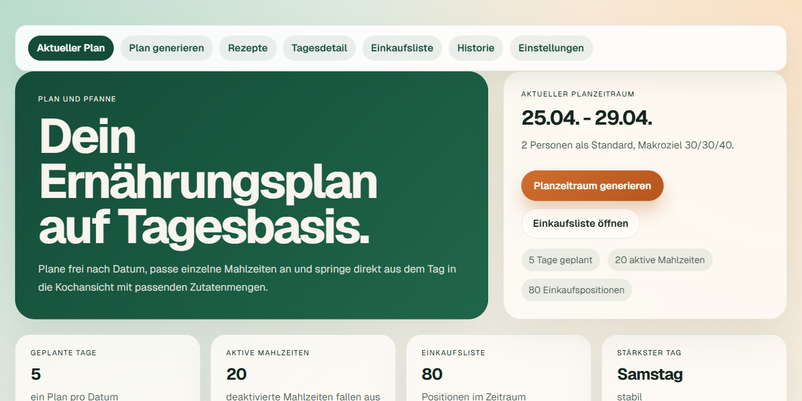
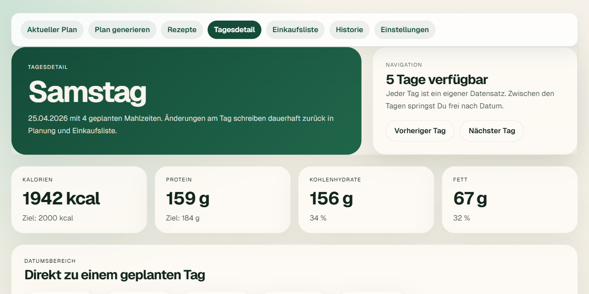
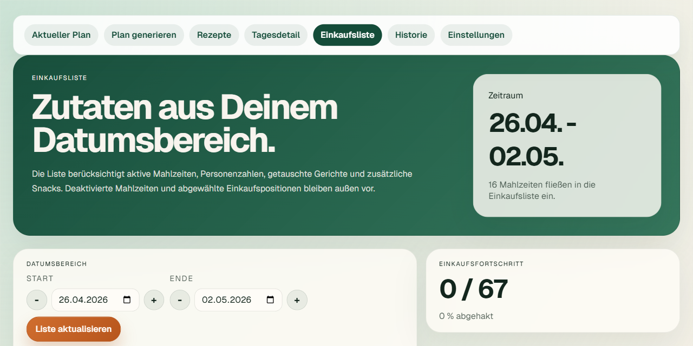
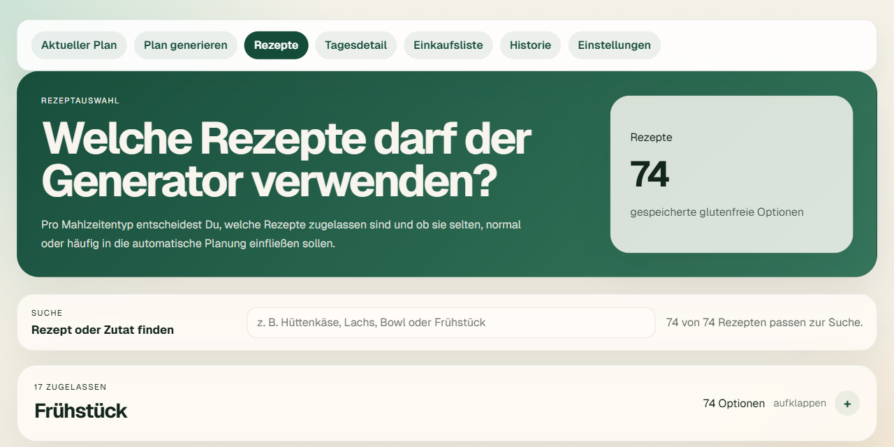

# Plan und Pfanne

`Plan und Pfanne` ist eine installierbare Tagesplan- und Rezept-App für glutenfreie Mahlzeiten. Die App speichert Tagespläne, Einstellungen, Rezeptzulassung und Historie lokal auf dem Gerät und läuft als statisch exportierte PWA über GitHub Pages.

## Was die App bietet

Die App unterstützt Dich dabei, glutenfreie Mahlzeiten über frei wählbare Datumsbereiche zu planen, einzelne Tage nachzubearbeiten und aus dem Plan heraus direkt zu kochen. Du erzeugst Tagespläne mit Frühstück, Mittagessen, Abendessen und optionalen Snacks, passt Personenzahlen oder Rezepte pro Mahlzeit an und steuerst, welche Gerichte in der Einkaufsliste landen.

Der aktuelle Plan zeigt Tageskarten mit Kalorien, Makros und aktiven Mahlzeiten. Die Kochansicht skaliert Zutaten temporär auf die gewünschte Personenzahl, ohne den Tagesplan zu verändern. Die Rezeptseite verwaltet, welche Rezepte der Generator je Mahlzeitentyp verwenden darf, inklusive Suche, Details, Gewichtung und Zulassung. Die Einkaufsliste fasst Zutaten über einen Datumsbereich zusammen und berücksichtigt nur aktive, einkaufsrelevante Mahlzeiten.

## Screenshots

| Aktueller Plan | Tagesdetail |
| --- | --- |
|  |  |

| Einkaufsliste | Rezeptauswahl |
| --- | --- |
|  |  |

## Produktmodell

- direkte Nutzung ohne Kontoverwaltung
- Speicherung auf dem Gerät über IndexedDB
- Planung auf Tagesebene mit frei wählbaren Datumsbereichen
- pro Datum maximal ein Plan
- Personenzahl pro Plan und pro einzelner Mahlzeit
- direkte Kochansicht aus dem Tagesdetail mit temporär skalierbarer Menge
- Einkaufsliste aus einem gewählten Datumsbereich
- Rezeptsuche, Rezeptdetails, Zulassung und Gewichtung je Mahlzeitentyp

## Was aktuell funktioniert

- Aktueller Plan mit Tageskarten und Makroübersicht
- Plan-Generator mit Startdatum, Enddatum, Personenzahl und Überschneidungswarnung
- Tagesdetail mit Gerichtstausch, Personenzahl, Ausfall-Schalter, Einkaufslisten-Flag und zusätzlichen Snacks
- Rezept-Kochansicht mit skalierten Zutaten und Zubereitungsschritten
- Rezeptauswahl je Mahlzeitentyp mit Suche, Detailansicht und Gewichtung `selten`, `normal`, `häufig`
- Einkaufsliste mit Datumsbereich, aktiven Mahlzeiten und aggregierten Mengen
- Historie als Tagesliste mit Kopieren historischer Zeiträume
- Einstellungen für Standard-Personenzahl, Kalorienziel, Makros, Eiweißziel, Snacks, Zielmix, ausgeschlossene Zutaten und Löschen alter Pläne

## Wichtige Grenzen

- Die Daten bleiben an dieses Gerät und dieselbe App-Origin gebunden.
- Es gibt aktuell keinen Export-, Backup- oder Gerätewechselpfad.
- Neue Rezepte kommen im aktuellen Stand über eingebauten Startbestand; ein Dateiimport oder Feed ist noch nicht umgesetzt.
- Frühere Routen wie `/anmelden`, `/abmelden` und einige `/api/*`-Pfade bleiben nur aus Kompatibilitätsgründen erreichbar und gehören nicht mehr zum normalen Produktfluss.

## Lokale Entwicklung

```bash
npm install
npm run dev
```

Für Tests auf dem Handy im selben WLAN:

```bash
npm run dev:handy
```

Dann die lokale IPv4-Adresse im Browser des Handys öffnen, zum Beispiel `http://192.168.178.23:3000`.

## Build und Vorschau

Der GitHub-Pages-Build ist auf `Next.js static export` zugeschnitten:

- `output: "export"` in `next.config.ts`
- `trailingSlash: true` für statische Verzeichnisrouten
- `basePath` über `NEXT_PUBLIC_BASE_PATH`, damit die App sauber unter `/<repo>/` läuft
- PWA-Manifest, Service Worker und Registrierung berücksichtigen diesen Unterpfad
- GitHub Actions baut und deployt nach `out/`

```bash
npm run lint
npm run build
npm run preview
```

`npm run preview` serviert den Inhalt aus `out/` und entspricht damit dem GitHub-Pages-Zielpfad deutlich besser als ein klassischer Next-Server.

## Deployment über GitHub Pages

In GitHub:

1. Repository öffnen
2. `Settings`
3. `Pages`
4. `Build and deployment`
5. `Source = GitHub Actions`

Der Workflow liegt unter [.github/workflows/deploy-pages.yml](.github/workflows/deploy-pages.yml).

## Live-URL

Die aktuell deployte URL für dieses Repository ist:

- `https://levelx2.github.io/plan-und-pfanne/`

Direkt öffnen:

- [Plan und Pfanne auf GitHub Pages](https://levelx2.github.io/plan-und-pfanne/)

## Basis-Pfad und App-Origin

Standardmäßig baut der Workflow für eine GitHub-Projektseite:

- `NEXT_PUBLIC_BASE_PATH=/<repo>`
- `NEXT_PUBLIC_SITE_URL=https://<owner>.github.io/<repo>`

Für dieses Repository ist die erwartete App-URL also:

- `https://levelx2.github.io/plan-und-pfanne/`

Optional können später Repository-Variablen gesetzt werden:

- `PAGES_BASE_PATH`
- `PAGES_SITE_URL`

Damit lässt sich ein späterer Wechsel auf eine eigene Domain vorbereiten, ohne den Workflow neu zu schreiben. Weil die App-Daten an dieselbe Origin gebunden sind, sollte ein solcher Wechsel bewusst geplant werden.

## PWA-Verhalten unter GitHub Pages

Die PWA ist auf den GitHub-Pages-Unterpfad zugeschnitten:

- `manifest.ts` prefixiert `start_url`, `scope` und Icon-Pfade mit dem aktiven `basePath`
- `pwa-register.tsx` registriert den Service Worker unter `${basePath}/service-worker.js`
- `public/service-worker.js` leitet Cache-Scope und Offline-Fallbacks dynamisch aus `self.registration.scope` ab

Dadurch bleiben Manifest, Service Worker und Offline-Fallbacks auch unter `/<repo>/` konsistent.

## Relevante Dateien für diesen Plattformpfad

- [next.config.ts](next.config.ts)
- [public/service-worker.js](public/service-worker.js)
- [src/app/layout.tsx](src/app/layout.tsx)
- [src/app/manifest.ts](src/app/manifest.ts)
- [src/app/pwa-register.tsx](src/app/pwa-register.tsx)
- [.github/workflows/deploy-pages.yml](.github/workflows/deploy-pages.yml)

## Referenzen

- [Next.js: Static Exports](https://nextjs.org/docs/app/building-your-application/deploying/static-exports)
- [GitHub Docs: Using custom workflows with GitHub Pages](https://docs.github.com/en/pages/getting-started-with-github-pages/using-custom-workflows-with-github-pages)
